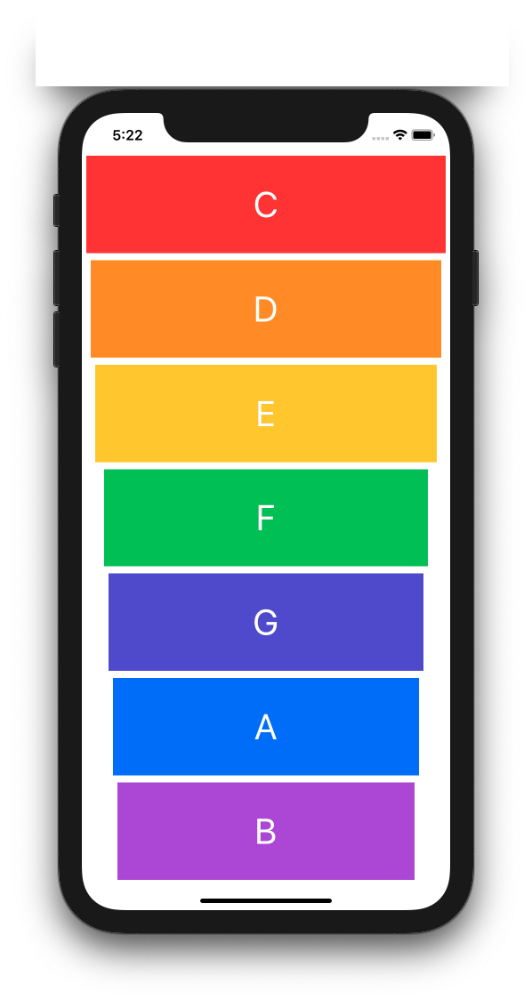
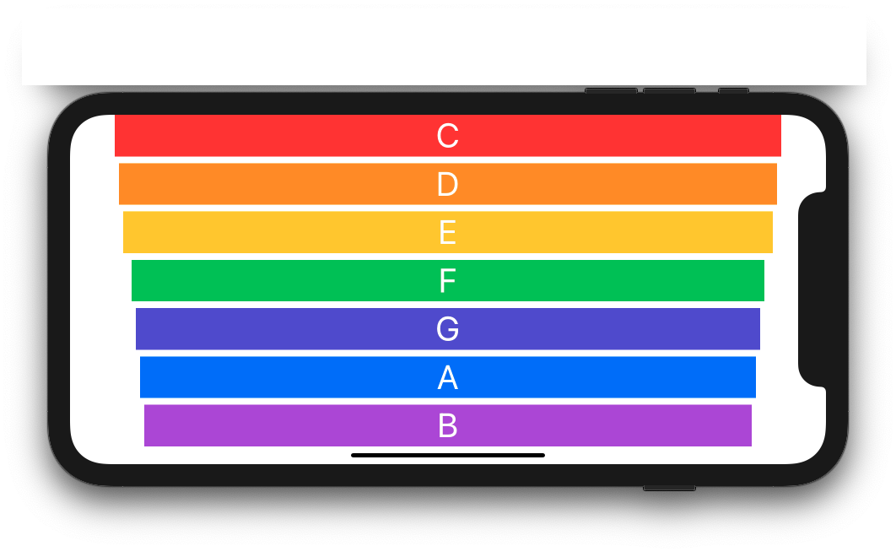
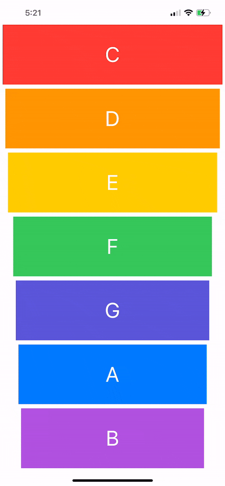

# Xylophone
### Screen Shots

---

### Table of Contents

- [Description](#description)
- [How To Use](#how-to-use)
- [Author Info](#author-info)

## Description

- A simple Xylophone

---

### What I Learned:

- How to play sound using AVFoundation and AVAudioPlayer.
- Understand Apple documentation.
- Functions and methods in Swift.
- Data types.
- Swift loops.
- Variable scope.
- The ViewController lifecycle.
- Error handling in Swift.
- Code refactoring.
- Basic debugging.

---

## How To Use

- Clone the project and run it on Xcode
---

## Author Info
- Website - [LinkedIn: Gurpreet Singh](https://www.linkedin.com/in/gurpreet-singh-a2651b107/)

[Back To The Top](#Xylophone)
